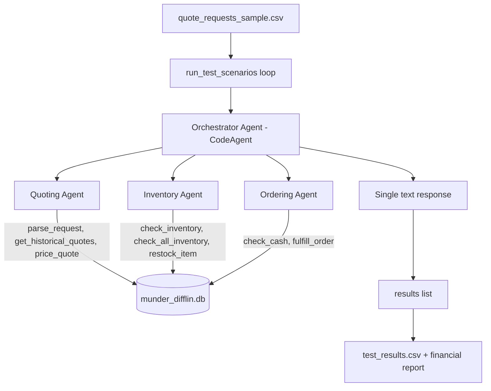

# Munder Difflin Multi-Agent System — Workflow Diagram

This document describes the agent architecture and data flow for the Munder Difflin
paper-company multi-agent system. It uses [Mermaid](https://mermaid.js.org/) diagrams,
which render directly in GitHub and most Markdown viewers.

## Agent Roster (4 agents, under the 5-agent limit)

| Agent | Type | Responsibility |
| --- | --- | --- |
| Orchestrator | `CodeAgent` | Routes each request, sequences the specialized agents, assembles one customer-facing reply |
| Quoting Agent | `ToolCallingAgent` | Parses the request, consults history, prices items, applies bulk discounts |
| Inventory Agent | `ToolCallingAgent` | Checks stock as of the request date, restocks, estimates delivery |
| Ordering Agent | `ToolCallingAgent` | Records sales, covers shortfalls, guards cash, confirms fulfillment |

## Architecture



## Per-Request Data Flow

```mermaid
sequenceDiagram
    participant Loop as run_test_scenarios
    participant Orch as Orchestrator
    participant Q as Quoting Agent
    participant Inv as Inventory Agent
    participant Ord as Ordering Agent
    participant DB as munder_difflin.db

    Loop->>Orch: request_with_date
    Orch->>Q: parse + price (as_of_date)
    Q->>DB: search_quote_history / prices
    Q-->>Orch: line_items + total + explanation (bulk discount)
    Orch->>Inv: check stock for line_items (as_of_date)
    Inv->>DB: get_stock_level / restock (stock_orders)
    Inv-->>Orch: availability + restock/delivery info
    Orch->>Ord: fulfill accepted items (as_of_date)
    Ord->>DB: record sales / restock shortfall
    Ord-->>Orch: sales recorded + confirmation
    Orch-->>Loop: single text response (quote + availability + fulfillment)
```

## Bulk Discount Rule

```
total units >= 1000  OR  subtotal >= $500  -> 10% discount
total units >=  500  OR  subtotal >= $200  ->  5% discount
otherwise                                  ->  no discount
```

## Notes

- Agents never touch the database directly; they call `@tool` wrappers that reuse the
  utility functions in `project_starter.py` and add business rules (name normalization,
  bulk discounts, affordability checks).
- The request date (`as_of_date`) is passed to every agent so inventory, stock, cash,
  and delivery calculations stay time-consistent.
- Item names are normalized to exact database names before any transaction, so
  `create_transaction` never fails on a name mismatch.
